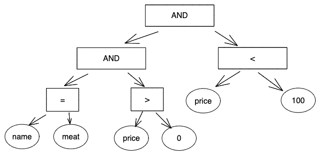

# README

Where 语句层级表达式：



运行 `simple_sql`：

```sh
./bin/simple_sql "CREATE TABLE students (name VARCHAR(20), age INTEGER, grade INTEGER);"
./bin/simple_sql "CREATE TABLE students (age INTEGER, grade INTEGER); INSERT INTO students(age, grade) VALUES(10, 10); SELECT grade FROM students WHERE age > 5;"
```

```
$ curl  -X POST -d 'CREATE TABLE students (name VARCHAR(20), age INTEGER, grade INTEGER);' http://localhost:8888
```
